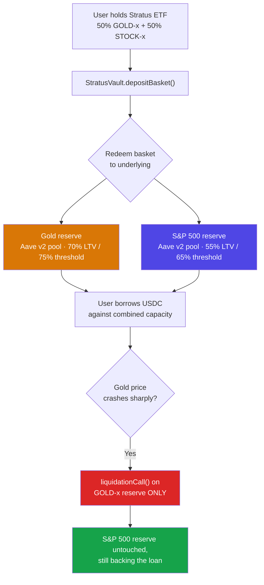
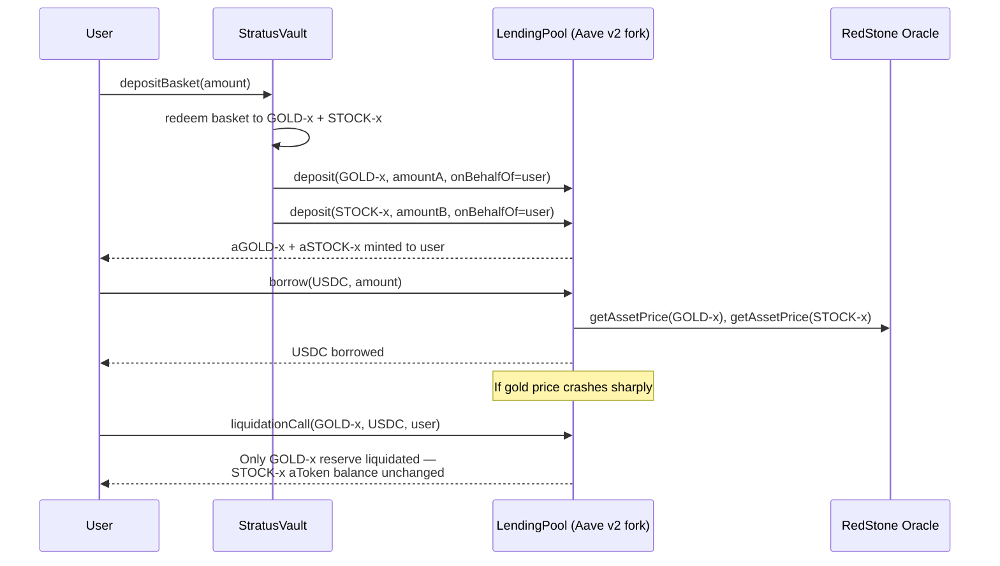

<h1 align="center">Stratus Finance</h1>

<p align="center">
  RWA basket collateral, without the basket risk — isolated per-asset lending on Hedera.
</p>

<p align="center">
  <strong>ETHGlobal ETHOnline 2026 · Hedera — Tokenization of Anything ($6,000, up to 3 teams @ $2,000)</strong>
</p>

---

Stratus Finance lets a wallet deposit a diversified RWA basket — tokenized gold plus a tokenized S&P 500 index, wrapped as one ERC-20 — and borrow against it without selling. Depositing decomposes the basket **on-chain, at the point of deposit**, into two separate, isolated lending reserves, each with its own risk parameters. A price crash in one leg can never force-liquidate the other.

> **Deposit the basket. Get two isolated positions. Never liquidate the whole thing for one leg's mistake.**
>
> - **Gold crashes 90%?** `liquidationCall()` touches the gold reserve only. The S&P 500 leg keeps backing the loan, untouched — proven on-chain, both directions: `0.3` → `0.3` and `800.0` → `800.0`.
> - **Everything else** (mint, deposit/decompose, borrow, repay) runs on a real, unmodified Aave v2 pool and real Hedera Asset Tokenization Studio tokens — not simulated, not mocked pricing.

**Status: built and verified on Hedera testnet.** Every mechanism described below has been run for real on-chain, not just unit-tested. See [Live Deployment & Verified Results](#smart-contract-details) for every address and transaction hash.

---

## What Makes Stratus Special

### Who This Is For

Meet Sarah. She built a diversified RWA position on Hedera: half tokenized gold, half a tokenized S&P 500 index, bought straight through Stratus's marketplace. It's a real hedge — gold and equities rarely crash together. Then rent's due, and she doesn't want to sell either leg. She just needs some USDC for a month.

She checks the usual lending markets. Aave-style protocols and Morpho all say the same thing: single-asset RWA collateral only. Her diversified position, wrapped as one ETF-style token, isn't accepted anywhere — not because it's worth less, but because no protocol wants to price and liquidate a basket as one blob. If gold crashes and stocks don't, a naive protocol would liquidate **both** legs to cover the shortfall on one.

Sarah's problem isn't that her collateral is bad. It's that no lending market on Hedera treats a basket's two legs as what they actually are: two separate risks that happen to share one wrapper token.

*(Sarah is illustrative — a stand-in for the real, general problem below, not a claimed user.)*

### The Problem

- RWA basket tokens — portfolios that bundle multiple asset classes (stocks, gold, bonds) into one ETF-style token — cannot currently be used as collateral in any lending market.
- This is a deliberate industry limitation, not an oversight: established protocols like Morpho explicitly accept only single-asset RWA collateral, never diversified baskets.
- The reason is technical: a combined basket is hard to price reliably in real time, and hard to liquidate safely — a price move in one component shouldn't force-liquidate components that haven't moved.
- The closest prior art, **All Weather Finance** (ETHGlobal New Delhi, Hedera 2nd place), built exactly this kind of basket on Hedera — but it's static. Holdable, never usable as collateral.

### The Solution

Stratus solves this with **look-through isolation**, decomposing the basket at the point of deposit instead of listing it as one collateral asset:

**1. Look-Through Decomposition at Deposit** — `StratusVault.depositBasket()` pulls the basket token, redeems it back to its two underlying components, and deposits each one into its own isolated Aave v2 reserve, on the user's behalf. A real transfer, not an accounting fiction.

**2. Independently-Calibrated Risk Per Leg** — Gold gets 70% LTV / 75% liquidation threshold / 5% bonus (low volatility, deep real-world liquidity). The S&P 500 leg gets 55% / 65% / 10% (higher volatility, equity drawdown risk). Different numbers, not the same risk wearing two labels.

**3. Isolated Liquidation, Proven Both Directions** — If gold crashes, `liquidationCall()` executes only against the gold reserve. Verified for real on Hedera testnet: STOCK-x aToken balance `0.3` before a −90% gold crash, `0.3` after. Mirror case (stock crashes instead): GOLD-x balance `800.0` → `800.0`, unchanged.

**4. Real Aave v2 Core, Not Reimplemented** — Forked `bonzo-finance-contracts` (Bonzo Finance's own open-source Aave v2 fork), deployed through the actual upgradeable-proxy flow. Health factor, interest accrual, and `liquidationCall` are audited upstream logic.

**5. Real ATS Tokenization, Real Compliance Gating** — GOLD-x and STOCK-x are real Hedera Asset Tokenization Studio Equity diamonds (ERC-1400-style, control-list gated), not placeholder ERC-20s. Every protocol contract that touches them — the pool, the vault, both aTokens, the demo liquidator — is explicitly whitelisted.

**6. Real Prices, No Substitutes** — RedStone's real, signed pull-oracle feeds: GOLD-x tracks the actual gold spot price (`XAU`), STOCK-x tracks the actual S&P 500 index level (`USA500.Y`). Getting here meant checking every oracle actually integrated with Hedera and finding Pyth blocked, Chainlink and Supra crypto-only — full trail in [`docs/phase-3-oracle-research.md`](./docs/phase-3-oracle-research.md).

---

## Risk Isolation, Side by Side

The point of isolation only holds if the two legs are actually configured differently — not uniform numbers wearing two labels.

| | Gold Leg | S&P 500 Index Leg |
|---|---|---|
| **LTV** | 70% | 55% |
| **Liquidation threshold** | 75% | 65% |
| **Liquidation bonus** | 5% | 10% |
| **Rationale** | Low volatility, deep real-world liquidity | Higher volatility, equity drawdown risk |
| **Verified liquidation-immunity** | `0.3` → `0.3` aToken balance after gold −90% crash | `800.0` → `800.0` aToken balance after stock −60% crash |

---

## Features

- **Look-Through Basket Decomposition** — `depositBasket()` pulls the sETF, redeems it, and deposits each leg into its own isolated Aave v2 reserve, on-chain, not an accounting fiction.
- **Isolated Liquidation, Proven On-Chain** — `liquidationCall()` targets one reserve; the untouched leg's aToken balance is byte-for-byte identical before and after, verified both directions.
- **Real ATS Tokenization** — GOLD-x and STOCK-x are compliance-gated ATS Equity diamonds, issued directly via `@hashgraph/asset-tokenization-contracts`.
- **Real Live Pricing** — RedStone signed feeds for gold spot and the S&P 500 index level, plus 10 individual real-stock reserves (Apple, Tesla, Microsoft, Nvidia, Alphabet, Amazon, Meta, Berkshire Hathaway, AMD, Palantir).
- **Real Aave v2 Lending Core** — forked, unmodified `bonzo-finance-contracts`, deployed through the standard upgradeable-proxy flow.
- **Self-Serve Marketplace** — `StratusMarketplace` lets any wallet buy tokenized Gold/S&P 500/stocks with USDC, auto-whitelisted on the ATS control list in the same transaction, no admin step.
- **20 Crypto Borrow Reserves** — BTC, ETH, USDT, XRP, BNB, SOL, DOGE, ADA, TRX, AVAX, SHIB, LINK, DOT, BCH, TON, SUI, NEAR, LTC, ICP, UNI, all borrowable alongside USDC.
- **Disclosed Demo-Stress Mechanism** — an owner-gated, event-logged price offset for demoing liquidation, always shown on-screen via a persistent banner, never a silent manipulation.
- **Upstream ATS Contributions** — three real friction points filed against `hashgraph/asset-tokenization-studio`.

---

## Tech Stack

| Layer | Technology | Role |
|---|---|---|
| RWA tokenization | Hedera Asset Tokenization Studio (ATS) | Real, compliant ERC-1400-style diamond tokens for GOLD-x and STOCK-x |
| Price feeds (live) | **RedStone** | GOLD-x tracks real gold spot (`XAU`), STOCK-x tracks the real S&P 500 index (`USA500.Y`), plus 10 individual real-stock reserves |
| Price feeds (alternate, live) | Chainlink | Real, push-based feeds on Hedera testnet — kept as a working alternate, one `setPriceOracle` call away |
| Price feeds (as designed) | Pyth Network | Fully implemented and unit-tested, blocked by Pyth/Hedera infrastructure outside this repo's control |
| Lending core + liquidation engine | Forked `bonzo-finance-contracts` (Aave v2) | Real, unmodified, deployed through the standard upgradeable-proxy flow |
| Basket wrapper (core original contribution) | `StratusBasketToken` + `StratusVault` | Decomposes/recomposes the basket token into isolated reserve positions |
| Risk view (original contribution) | `StratusRiskView` | Per-component health-factor heuristic alongside the pool's real, enforced health factor |
| Frontend | React, TypeScript, Tailwind, ethers v6 | Wired to the live deployment: mint, deposit/decompose, borrow/repay, portfolio |
| Wallets | MetaMask (Hedera EVM) | Auto-switches/adds the Hedera testnet chain |

---

## Hedera API Integration

| Component | File | Description |
|---|---|---|
| **ATS Client** | [`tokenization/scripts/lib/ats-client.ts`](./tokenization/scripts/lib/ats-client.ts) | Direct calls to ATS diamond contracts (issue, mint, whitelist) — bypasses the official SDK's lack of headless/private-key signing support |
| **Basket Decomposition** | [`contracts/src/StratusVault.sol`](./contracts/src/StratusVault.sol) | `depositBasket()` / `recomposeBasket()` — the core original contribution |
| **Basket Wrapper** | [`contracts/src/StratusBasketToken.sol`](./contracts/src/StratusBasketToken.sol) | `mint()` / `redeem()` — fixed-ratio ERC-20 wrapper that actually holds the underlying |
| **Per-Component Risk** | [`contracts/src/StratusRiskView.sol`](./contracts/src/StratusRiskView.sol) | `getUserRisk()` — per-leg health-factor heuristic alongside the pool's real, enforced number |
| **RedStone Oracle (live)** | [`contracts/src/StratusRedstoneOracle.sol`](./contracts/src/StratusRedstoneOracle.sol) | Live, signed pull-oracle price feeds for gold spot + S&P 500 index level |
| **Chainlink Oracle (alternate, live)** | [`contracts/src/StratusChainlinkPriceOracle.sol`](./contracts/src/StratusChainlinkPriceOracle.sol) | Real, push-based feeds kept as a working alternate |
| **Pyth Oracle (as designed)** | [`contracts/src/StratusPriceOracle.sol`](./contracts/src/StratusPriceOracle.sol) | Originally designed oracle, plus the tinybar-precision fix (`_roundUpToTinybar`) — see [Additional feedback](#additional-feedback-for-hedera) below |
| **Live Price Reader** | [`contracts/src/StratusLivePriceReader.sol`](./contracts/src/StratusLivePriceReader.sol) | Standalone real-time price reads for the UI, independent of the pool's cached oracle |
| **Lending Core** | [`contracts/lib/bonzo/`](./contracts/lib/bonzo/) | Forked, unmodified `bonzo-finance-contracts` (Aave v2) |
| **Self-Serve Marketplace** | [`contracts/src/StratusMarketplace.sol`](./contracts/src/StratusMarketplace.sol) | `buy()` — purchase tokenized assets with USDC, auto-whitelist in the same transaction |
| **HTS Token Association** | [`frontend/src/pages/Advisor.tsx`](./frontend/src/pages/Advisor.tsx) | Calls the `0x167` HTS precompile (`associateToken`) before interacting with native HTS reserves |

### Hedera Endpoints in Use

| API | Endpoint | Purpose |
|---|---|---|
| JSON-RPC relay | `https://testnet.hashio.io/api` | All contract reads/writes — chain id 296 |
| Mirror node | `https://testnet.mirrornode.hedera.com` | Transaction result / revert-reason lookups during development and verification |
| ATS Factory / Resolver | `0xd1F118A40f3b02883D35909eF2517e7EDd78379d` / `0xBA2D5FC2083A0b8f164c50e65d782087fBA18E0a` | Issues and resolves the ATS Equity diamond contracts for GOLD-x / STOCK-x |
| HTS system precompile | `0x0000000000000000000000000000000000000167` | Native token association, called directly before approving/transferring third-party HTS reserves |

---

## Architecture



### On-Chain Sequence



---

## Setup

### Contracts

```bash
npm install

# Local unit tests, no network needed
cd contracts && npm run compile && npm test

# Deploy scripts that touch the live testnet deployment are numbered/named
# under contracts/script/ and contracts/lib/bonzo/script/ — see
# contracts/script/README.md for the exact order they were run in.
```

### Tokenization (ATS)

```bash
cd tokenization
cp .env.example .env   # funded Hedera testnet account, holds ROLE_CONTROL_LIST
npm run issue:assets
```

### Frontend

```bash
cd frontend
cp .env.example .env   # already pointed at the live deployment below
npm run dev
```

Requires a `.env` in `contracts/` and `tokenization/` with a funded Hedera testnet account to run anything against the live network — the unit test suites (`contracts/test/`) need no network access at all.

---

## How It Works

### User Flow

```
Faucet / Buy → Mint Basket → Deposit & Decompose → Borrow → (if unhealthy) Isolated Liquidation
```

1. **Acquire Gold + S&P 500 Index** — via the Faucet (free testnet mint) or the Marketplace (`/buy`, pay in USDC, auto-whitelisted on the ATS control list in the same transaction).
2. **Mint the basket** — combine 50/50 into one Stratus ETF token (`/mint`).
3. **Deposit & decompose** — one action splits it into two isolated reserve positions (`/deposit`).
4. **Borrow** — draw USDC against the combined capacity of both legs (`/borrow`).
5. **If a leg's price crashes** — only that reserve gets liquidated; the other keeps backing the loan.

---

## Smart Contract Details

### Contract Addresses (Hedera Testnet, chain id 296)

Full record with every transaction hash in [`deployments/hederaTestnet.json`](./deployments/hederaTestnet.json).

| Contract | Address |
|---|---|
| GOLD-x (ATS Equity) | [`0xcF19378058EC9DFD25975527BDf7F68faeC2C7fc`](https://hashscan.io/testnet/contract/0xcF19378058EC9DFD25975527BDf7F68faeC2C7fc) |
| STOCK-x (ATS Equity) | [`0x59E3908069993cDDbD3C83479c1aFc92242c0d3A`](https://hashscan.io/testnet/contract/0x59E3908069993cDDbD3C83479c1aFc92242c0d3A) |
| MockUSDC (debt asset) | [`0xDc2088fd97eda106943cABf443cA5c6702c37154`](https://hashscan.io/testnet/contract/0xDc2088fd97eda106943cABf443cA5c6702c37154) |
| StratusBasketToken | [`0x2255Eb7Bc29A27E2b9113D6BA28807812Bd4DEaD`](https://hashscan.io/testnet/contract/0x2255Eb7Bc29A27E2b9113D6BA28807812Bd4DEaD) |
| StratusVault | [`0x7F16Cd599BF2aDBBacD856263ef36eABFfeC06B2`](https://hashscan.io/testnet/contract/0x7F16Cd599BF2aDBBacD856263ef36eABFfeC06B2) |
| StratusRiskView | [`0x499a48fAAC43c79E2bd0c99D8b9cB601eF0755D2`](https://hashscan.io/testnet/contract/0x499a48fAAC43c79E2bd0c99D8b9cB601eF0755D2) |
| StratusRedstoneOracle (live) | [`0x7aa45f5Ff7e99f13C60F6f3913aaff68E51DfdD9`](https://hashscan.io/testnet/contract/0x7aa45f5Ff7e99f13C60F6f3913aaff68E51DfdD9) |
| StratusChainlinkPriceOracle (alternate, live) | [`0x784B85521B77F43655960718539E85fBa012e659`](https://hashscan.io/testnet/contract/0x784B85521B77F43655960718539E85fBa012e659) |
| StratusPriceOracle (Pyth, as designed) | [`0xB590789A6cC576ED8C14A3E846c16b9f9a4Cc681`](https://hashscan.io/testnet/contract/0xB590789A6cC576ED8C14A3E846c16b9f9a4Cc681) |
| LendingPool (Bonzo/Aave v2 fork) | [`0x36f251a19372c550cc3784E108391eeC004B903E`](https://hashscan.io/testnet/contract/0x36f251a19372c550cc3784E108391eeC004B903E) |

Plus **10 individual real-stock reserves** (Apple, Tesla, Microsoft, Nvidia, Alphabet, Amazon, Meta, Berkshire Hathaway, AMD, Palantir) — each its own ATS token, pool reserve, and live RedStone price feed, deposited/borrowed directly at `/stocks`. Full address table in [`docs/phase-4-individual-stocks.md`](./docs/phase-4-individual-stocks.md).

Plus **StratusMarketplace** (`/buy`) and **20 top-market-cap crypto reserves** borrowable alongside USDC at `/borrow` — see [`docs/phase-5-crypto-borrow.md`](./docs/phase-5-crypto-borrow.md).

### Key Functions

```
StratusVault
  depositBasket(uint256 basketAmount)                                   — decompose the basket into two isolated reserve deposits
  recomposeBasket(uint256 basketAmount)                                 — pull withdrawn underlying, re-mint the basket token
  event BasketDecomposed(user, basketAmount, amountA, amountB)
  event BasketRecomposed(user, basketAmount, amountA, amountB)

StratusBasketToken
  previewComponents(uint256 basketAmount) view returns (amountA, amountB)
  mint(uint256 basketAmount) returns (amountA, amountB)
  redeem(uint256 basketAmount) returns (amountA, amountB)

StratusRiskView
  getUserRisk(address user, address componentA, address componentB)
    returns (UserRisk memory risk)                                      — per-leg + combined health factor in one read

StratusMarketplace
  quote(address token, uint256 tokenAmount) view returns (uint256 usdcCost)
  buy(address token, uint256 tokenAmount)                                — pay USDC, receive the token, auto-whitelisted
```

---

## Deployment Checklist

- [x] Real ATS Equity diamonds issued for GOLD-x and STOCK-x
- [x] Real, unmodified Aave v2 lending core (Bonzo fork), deployed through the actual upgradeable-proxy flow
- [x] `StratusVault` — basket decompose/recompose, both directions verified on-chain
- [x] `StratusRiskView` — per-component health factor alongside the pool's real, enforced number
- [x] Real RedStone price feeds for gold spot + S&P 500 index level
- [x] Chainlink kept wired as a real, working alternate oracle
- [x] Isolated liquidation, proven both directions (gold-crashes and stock-crashes scenarios)
- [x] 10 individual real-stock reserves (deposit/withdraw verified)
- [x] Self-serve marketplace + 20 crypto borrow reserves
- [x] Frontend wired to the live deployment, verified in a real browser session
- [x] Three upstream ATS friction points filed
- [ ] Custom allocation ratios / N-asset baskets (noted as future work in [`PLAN.md`](./PLAN.md))

### What's Been Proven, On-Chain, For Real

| Gate | Result |
|---|---|
| **Gate 1** — basket mint/redeem round trip | Passed — real ATS underlying, exact balances, zero dust |
| **Gate 2** — deposit → borrow → repay → withdraw, raw pool | Passed, fully |
| **Gate 3** — basket deposit/decompose + withdraw/recompose | Passed, fully |
| **Gate 4** — isolated liquidation, both directions | Passed — untouched-leg invariant held exactly both times |
| **Gate 5** — frontend wired and reading live data | Verified in a real browser session |
| **Individual stocks** — deposit/withdraw on a newly-added reserve | Passed — AAPL-x, balances restored exactly |

Full phase-by-phase build log, every architectural decision, and every blocker encountered (including the ones that didn't work) are in [`PLAN.md`](./PLAN.md) and the `docs/phase-*-findings.md` files — written as they happened, not cleaned up after the fact.

---

## Hackathon Submission

| | |
|---|---|
| **Event** | ETHGlobal ETHOnline 2026 |
| **Primary track** | Hedera — Tokenization of Anything ($6,000, up to 3 teams @ $2,000) |
| **Secondary track** | Open Source: Improve the Hedera Harness ($2,000) |
| **ATS upstream contribution** | 3 friction points filed against `hashgraph/asset-tokenization-studio` — [#1397](https://github.com/hashgraph/asset-tokenization-studio/issues/1397), [#1398](https://github.com/hashgraph/asset-tokenization-studio/issues/1398), [#1399](https://github.com/hashgraph/asset-tokenization-studio/issues/1399) |
| **Hedera Harness contribution** | New Tier 0-1 deterministic check for the tinybar-precision gotcha — [PR #45](https://github.com/hedera-dev/hedera-harness/pull/45) |

### Additional Feedback for Hedera

A real rough edge hit building this project: a Pyth refund (`msg.value - fee`) silently rounded to zero because Hedera's 8-decimal tinybar ledger drops native-value amounts below `1e10` wei, including internal contract-to-contract forwards. Fixed in [`contracts/src/StratusPriceOracle.sol`](./contracts/src/StratusPriceOracle.sol) (`_roundUpToTinybar`), documented in [`docs/phase-2-findings.md`](./docs/phase-2-findings.md), and contributed upstream to `hedera-dev/hedera-harness` so agent-generated Hedera contracts get the same guardrail.

---

## Not Part of This Submission

The live app's nav also has **Stake**, **Advisor**, and (from Advisor) live rate comparisons against **Bonzo Finance** and **Cirrus Finance** (a second lending market this same project also deployed). These are real, working, and disclosed as such in `docs/phase-6-ai-advisor.md` — but they're generic DeFi features (a reward-token staking pool, a deterministic + optional-LLM yield ranker, an x402 payment-gated premium tier) with no connection to Hedera tokenization or basket-collateral lending, and no separate prize track at this event covers them either. They exist because this repo kept growing after the Hedera-track submission was already feature-complete, not because they're part of what's being submitted here. **The actual submission is everything above this line** — the basket mint → deposit/decompose → borrow → isolated liquidation flow. Treat everything past this section as an unscored exploration, not a second pitch competing for the same judges' attention.

---

## Repository Layout

```
stratus-finance/
├─ contracts/                 # Hardhat workspace — lending core (Bonzo/Aave v2 fork) + Stratus contracts
├─ tokenization/              # ATS scripts: issue GOLD-x / STOCK-x, control-list management
├─ frontend/                  # React + TypeScript + Tailwind dashboard, wired to the live deployment
├─ deployments/               # Testnet deployment addresses + every verification tx hash
├─ docs/                      # Risk param rationale, demo script, phase-by-phase findings, ATS upstream friction log
├─ PLAN.md                    # Development plan — phases, gates, risk register, all marked with actual status
└─ README.md                  # This file
```

See [`PLAN.md`](./PLAN.md) for the phased build plan, architecture decisions, and testing strategy.

---

## License

MIT

---

> Two legs, one wrapper, zero shared risk — Stratus Finance
