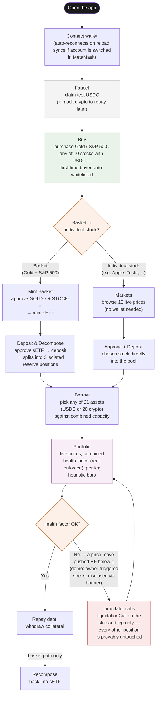

# Stratus Finance — Architecture & User Flow

Two diagrams: the infrastructure (what's deployed and how it talks to
itself) and the user flow (what a person actually does, click by click).
Every component named here is real and deployed on Hedera testnet — see
[`README.md`](../README.md) §9 and
[`deployments/hederaTestnet.json`](../deployments/hederaTestnet.json)
for addresses and transaction hashes.

## Infrastructure

```mermaid
flowchart TB
    subgraph OFFCHAIN["Off-chain"]
        REDSTONE["RedStone Gateway\n(signed price data:\nXAU, USA500.Y, USDC,\n10 stocks, 20 crypto)"]
        UPDATER["update-redstone-prices.ts\n(cache refresh — must run\nat least every 6h)"]
        REDSTONE -->|"fetch signed\nprice package"| UPDATER
    end

    subgraph FRONTEND["Frontend (React + ethers v6)"]
        UI["Faucet / Buy / Mint Basket /\nDeposit / Borrow / Portfolio / Markets"]
        WALLET["MetaMask\n(Hedera testnet, chain 296 —\nauto-reconnect + account sync)"]
        UI <--> WALLET
        LIVECLIENT["fetchLivePrices()\n(wraps eth_call in-browser,\nzero gas)"]
        UI --> LIVECLIENT
    end

    subgraph HEDERA["Hedera Testnet — chain 296"]
        subgraph TOKENS["Asset Tokenization Studio (ATS)"]
            GOLD["GOLD-x\n(real gold, diamond)"]
            STOCKIDX["STOCK-x\n(real S&P 500, diamond)"]
            STOCKS["10 individual stock diamonds\nAAPL-x · TSLA-x · MSFT-x · NVDA-x\nGOOGL-x · AMZN-x · META-x\nBRKB-x · AMD-x · PLTR-x"]
        end

        subgraph MOCKASSETS["Plain ERC-20 testnet assets"]
            USDC["MockUSDC"]
            CRYPTO["20 MockCrypto reserves\nBTC · ETH · USDT · ... · UNI"]
        end

        subgraph MARKET["StratusMarketplace"]
            MARKETPLACE["buy(token, amount)\npulls USDC, auto-whitelists\nthe caller, sends from\npre-funded inventory"]
        end

        subgraph BASKET["Basket wrapper"]
            BASKETTOKEN["StratusBasketToken\n(sETF, 50/50 Gold+S&P500)"]
            VAULT["StratusVault\n(decompose / recompose)"]
        end

        subgraph ORACLE["Price oracle"]
            REDSTONEORACLE["StratusRedstoneOracle\n(cache — updatePrice writes,\ngetAssetPrice reads,\n6h maxPriceAge, 33 feeds)"]
            LIVEREADER["StratusLivePriceReader\n(always-live, gasless —\nnot used by the pool)"]
        end

        subgraph POOL["Lending core — Bonzo / Aave v2 fork"]
            PROVIDER["LendingPoolAddressesProvider"]
            LENDINGPOOL["LendingPool\n(deposit / withdraw / borrow / repay /\nliquidationCall)"]
            CONFIGURATOR["LendingPoolConfigurator"]
            RESERVES["33 reserves total\nGOLD-x·STOCK-x·10 stocks\n(collateral only)\nUSDC + 20 crypto\n(collateral + borrow)"]
            RISKVIEW["StratusRiskView\n(per-component health factor,\nread-only)"]
        end
    end

    UI -->|"eth_call / eth_sendTransaction"| LENDINGPOOL
    UI --> BASKETTOKEN
    UI --> VAULT
    UI -->|"buy()"| MARKETPLACE
    UI -->|"mint() — testnet faucet only"| USDC
    UI -->|"mint() — testnet faucet only"| CRYPTO
    UI -->|"getAssetPrice (cached,\nno wallet needed)"| REDSTONEORACLE
    LIVECLIENT -->|"wrapped eth_call,\nsigned RedStone calldata"| LIVEREADER
    UI -->|"getUserRisk"| RISKVIEW

    UPDATER -->|"updatePrice(asset)\nwrapped tx"| REDSTONEORACLE

    MARKETPLACE -->|"quote() reads price"| REDSTONEORACLE
    MARKETPLACE -->|"whitelist + transfer\nfrom inventory"| GOLD
    MARKETPLACE -->|"whitelist + transfer\nfrom inventory"| STOCKIDX
    MARKETPLACE -->|"whitelist + transfer\nfrom inventory"| STOCKS

    VAULT -->|"holds & moves"| GOLD
    VAULT -->|"holds & moves"| STOCKIDX
    BASKETTOKEN -->|"mint / redeem"| GOLD
    BASKETTOKEN -->|"mint / redeem"| STOCKIDX

    LENDINGPOOL --> RESERVES
    RESERVES -.->|"underlying"| GOLD
    RESERVES -.->|"underlying"| STOCKIDX
    RESERVES -.->|"underlying"| STOCKS
    RESERVES -.->|"underlying"| USDC
    RESERVES -.->|"underlying"| CRYPTO

    LENDINGPOOL -->|"getAssetPrice per reserve"| REDSTONEORACLE
    RISKVIEW -->|"getUserAccountData"| LENDINGPOOL
    RISKVIEW -->|"getAssetPrice"| REDSTONEORACLE
    PROVIDER -.->|"setPriceOracle"| REDSTONEORACLE
    CONFIGURATOR -.->|"batchInitReserve /\nconfigureReserveAsCollateral"| RESERVES

    style OFFCHAIN fill:#f5f0e8,stroke:#9c8a6e
    style FRONTEND fill:#eef3fb,stroke:#5b7ba8
    style HEDERA fill:#fbfbfb,stroke:#333
    style TOKENS fill:#fdf0e8,stroke:#c17a3f
    style MOCKASSETS fill:#f4f4f4,stroke:#777
    style MARKET fill:#eaf3ea,stroke:#4a8f4a
    style BASKET fill:#f0f7ee,stroke:#5f9959
    style ORACLE fill:#f7eef7,stroke:#9c5d9c
    style POOL fill:#eef7f7,stroke:#3f8c8c
```

**Three independent paths into the pool.** The basket (GOLD-x + STOCK-x,
wrapped as sETF) is one path; the 10 individual stocks are deposited
directly — same `LendingPool.deposit`/`withdraw`, no wrapper; the 20
crypto reserves are collateral- *and* borrow-enabled, seeded with real
pool liquidity. All three read prices from the same
`StratusRedstoneOracle`, which is a *cache*, not a live feed:
`update-redstone-prices.ts` has to run at least every 6 hours (RedStone
is a pull oracle — see
[`docs/phase-3-oracle-research.md`](./phase-3-oracle-research.md)) or
`getAssetPrice` starts reverting with `"stale price"`. Display prices
never hit that ceiling — `StratusLivePriceReader` wraps a fresh signed
read on every call, independent of the cache.

## User flow

**The isolation guarantee, visually.** Whichever path a user takes —
basket or individual stock — a bad price move only threatens the reserve
it actually hit. Liquidation seizes that one leg; every other position
the user holds is provably unchanged (verified on-chain both directions
— see `PLAN.md` Gate 4).

**A known gap, deliberately not diagrammed as a "feature":** sETF is a
plain ERC-20 and is technically transferable via any wallet's own send
function, but the app has no dedicated Transfer page for it (or for any
token) yet. The only in-app path from "own a tokenized RWA" to "borrow
against it" is Deposit/Markets, not a peer-to-peer send.
